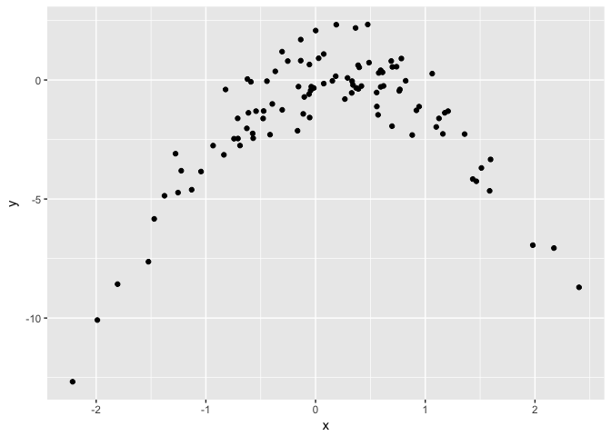

Homework 5
================
Jay Lee
October 13, 2017

**4.** One possible solution is as follows, using the bootstrap method. We resample (with replacement) many samples of size *n* from our original data set of size *n*. For each of these resamples, we use the same statistical learning method to predict some response value *Y* for the same particular input value *X*. Because each model will train on different data, the models will predict different values for *Y*. This gives us a simulated distribution of *Y*<sup>\*</sup>, which we can compute the standard deviation of to estimate the standard deviation of our prediction *Y*.

**8.**

1.  

``` r
set.seed(1)
x <- rnorm(100)
y <- x - 2*x^2 + rnorm(100)
parab <- data.frame(x,y)
```

*n* = 100, *p* = 1, *X* ∼ *N**o**r**m*(*μ* = 0, *σ* = 1), *Y* ∼ *N**o**r**m*(*μ* = *X* − 2*X*<sup>2</sup>, *σ* = 1)

1.  

``` r
ggplot(parab, aes(x, y)) + geom_point()
```



The data follows a negative quadratic shape, and has more points clustered in the middle at (*x*, *y*)≈(0, 0) than on the "outside" of the shape.

1.  

``` r
set.seed(1041)
cv_errors <- rep(NA, 4)
for (i in seq_len(4)) {
  poly_fit <- glm(y ~ poly(x, i, raw = T), data = parab)
  cv_errors[i] <- cv.glm(parab, poly_fit)$delta[1]
}
cv_errors
```

    ## [1] 7.2881616 0.9374236 0.9566218 0.9539049

1.  

``` r
set.seed(1232)
cv_errors_2 <- rep(NA, 4)
for (i in seq_len(4)) {
  poly_fit <- glm(y ~ poly(x, i, raw = T), data = parab)
  cv_errors_2[i] <- cv.glm(parab, poly_fit)$delta[1]
}
cv_errors_2
```

    ## [1] 7.2881616 0.9374236 0.9566218 0.9539049

The LOOCV errors are the same regardless of the seed used, because LOOCV is completely deterministic, i.e. it does not depend on any randomness. Each data point is valued equally.

1.  The quadratic model in (c) had the lowest LOOCV error. This makes sense, because our true model is quadratic. A linear model has too much bias, and any more complex model increases variance without improving the model fit.

2.  

``` r
for (i in seq_len(4)) {
  poly_fit <- glm(y ~ poly(x, i, raw = T), data = parab)
  print(summary(poly_fit))
}
```

    ## 
    ## Call:
    ## glm(formula = y ~ poly(x, i, raw = T), data = parab)
    ## 
    ## Deviance Residuals: 
    ##     Min       1Q   Median       3Q      Max  
    ## -9.5161  -0.6800   0.6812   1.5491   3.8183  
    ## 
    ## Coefficients:
    ##                     Estimate Std. Error t value Pr(>|t|)    
    ## (Intercept)          -1.6254     0.2619  -6.205 1.31e-08 ***
    ## poly(x, i, raw = T)   0.6925     0.2909   2.380   0.0192 *  
    ## ---
    ## Signif. codes:  0 '***' 0.001 '**' 0.01 '*' 0.05 '.' 0.1 ' ' 1
    ## 
    ## (Dispersion parameter for gaussian family taken to be 6.760719)
    ## 
    ##     Null deviance: 700.85  on 99  degrees of freedom
    ## Residual deviance: 662.55  on 98  degrees of freedom
    ## AIC: 478.88
    ## 
    ## Number of Fisher Scoring iterations: 2
    ## 
    ## 
    ## Call:
    ## glm(formula = y ~ poly(x, i, raw = T), data = parab)
    ## 
    ## Deviance Residuals: 
    ##     Min       1Q   Median       3Q      Max  
    ## -1.9650  -0.6254  -0.1288   0.5803   2.2700  
    ## 
    ## Coefficients:
    ##                      Estimate Std. Error t value Pr(>|t|)    
    ## (Intercept)           0.05672    0.11766   0.482    0.631    
    ## poly(x, i, raw = T)1  1.01716    0.10798   9.420  2.4e-15 ***
    ## poly(x, i, raw = T)2 -2.11892    0.08477 -24.997  < 2e-16 ***
    ## ---
    ## Signif. codes:  0 '***' 0.001 '**' 0.01 '*' 0.05 '.' 0.1 ' ' 1
    ## 
    ## (Dispersion parameter for gaussian family taken to be 0.9178258)
    ## 
    ##     Null deviance: 700.852  on 99  degrees of freedom
    ## Residual deviance:  89.029  on 97  degrees of freedom
    ## AIC: 280.17
    ## 
    ## Number of Fisher Scoring iterations: 2
    ## 
    ## 
    ## Call:
    ## glm(formula = y ~ poly(x, i, raw = T), data = parab)
    ## 
    ## Deviance Residuals: 
    ##     Min       1Q   Median       3Q      Max  
    ## -1.9765  -0.6302  -0.1227   0.5545   2.2843  
    ## 
    ## Coefficients:
    ##                      Estimate Std. Error t value Pr(>|t|)    
    ## (Intercept)           0.06151    0.11950   0.515    0.608    
    ## poly(x, i, raw = T)1  0.97528    0.18728   5.208 1.09e-06 ***
    ## poly(x, i, raw = T)2 -2.12379    0.08700 -24.411  < 2e-16 ***
    ## poly(x, i, raw = T)3  0.01764    0.06429   0.274    0.784    
    ## ---
    ## Signif. codes:  0 '***' 0.001 '**' 0.01 '*' 0.05 '.' 0.1 ' ' 1
    ## 
    ## (Dispersion parameter for gaussian family taken to be 0.9266599)
    ## 
    ##     Null deviance: 700.852  on 99  degrees of freedom
    ## Residual deviance:  88.959  on 96  degrees of freedom
    ## AIC: 282.09
    ## 
    ## Number of Fisher Scoring iterations: 2
    ## 
    ## 
    ## Call:
    ## glm(formula = y ~ poly(x, i, raw = T), data = parab)
    ## 
    ## Deviance Residuals: 
    ##     Min       1Q   Median       3Q      Max  
    ## -2.0550  -0.6212  -0.1567   0.5952   2.2267  
    ## 
    ## Coefficients:
    ##                       Estimate Std. Error t value Pr(>|t|)    
    ## (Intercept)           0.156703   0.139462   1.124    0.264    
    ## poly(x, i, raw = T)1  1.030826   0.191337   5.387 5.17e-07 ***
    ## poly(x, i, raw = T)2 -2.409898   0.234855 -10.261  < 2e-16 ***
    ## poly(x, i, raw = T)3 -0.009133   0.067229  -0.136    0.892    
    ## poly(x, i, raw = T)4  0.069785   0.053240   1.311    0.193    
    ## ---
    ## Signif. codes:  0 '***' 0.001 '**' 0.01 '*' 0.05 '.' 0.1 ' ' 1
    ## 
    ## (Dispersion parameter for gaussian family taken to be 0.9197797)
    ## 
    ##     Null deviance: 700.852  on 99  degrees of freedom
    ## Residual deviance:  87.379  on 95  degrees of freedom
    ## AIC: 282.3
    ## 
    ## Number of Fisher Scoring iterations: 2

These significance values show that in the linear case, the slope is somewhat significant and the intercept is very significant, then for all higher degree cases only the intercept, linear, and quadratic term have significant coefficient values. This agrees with the conclusions drawn from our CV results, which say that adding terms of order 3 or higher does not improve our model.
