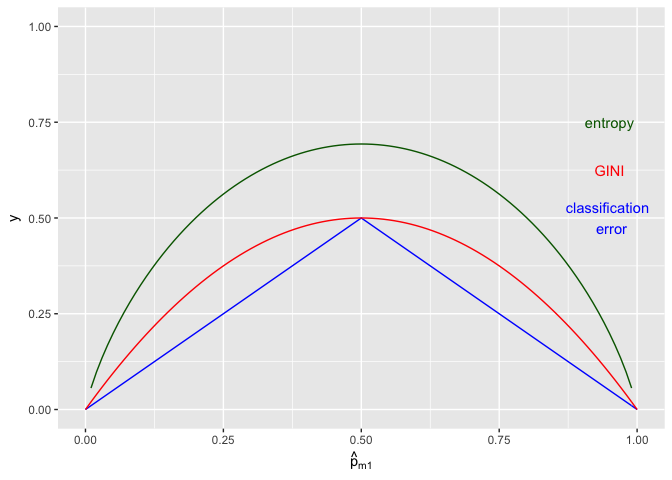

Problem Set 6
================
Jay Lee
October 29, 2017

### 1.

I based this on the tree I drew in 4a because figuring out how to draw an arbitrary tree took a while, so I just recycled a bunch of it.


### 3.

Because each of these must be computed for each region, I only show the plot for region *m* here.

``` r
library(ggplot2)
ggplot(data.frame(x=c(0, 1)), aes(x)) +
  stat_function(fun=function(x) -abs(x - .5) + .5, col = "blue") +
  stat_function(fun=function(x) 2*x*(1-x), col = "red") +
  stat_function(fun=function(x) -x*log(x) + -(1-x)*log(1-x), col = "darkgreen") +
  ylim(0,1) +
  labs(x = expression(hat(p)[m1])) +
  annotate("text", x = .95, y = c(.75, .625, .5), label = c("entropy", "GINI", "classification \n error"), col = c("darkgreen", "red", "blue"))
```

    ## Warning: Removed 2 rows containing missing values (geom_path).



### 4.

1.  


1.  


### 5.

Because the 10 probabilities are {0.1, 0.15, 0.2, 0.2, 0.55, 0.6, 0.6, 0.65, 0.7, 0.75}, the average prediction is 0.45. Since this mean is less than .5, the prediction using the "average" method is Green. 6 of the 10 probabilities classify the point as Red, however, so the prediction using the "majority vote" method is Red.
