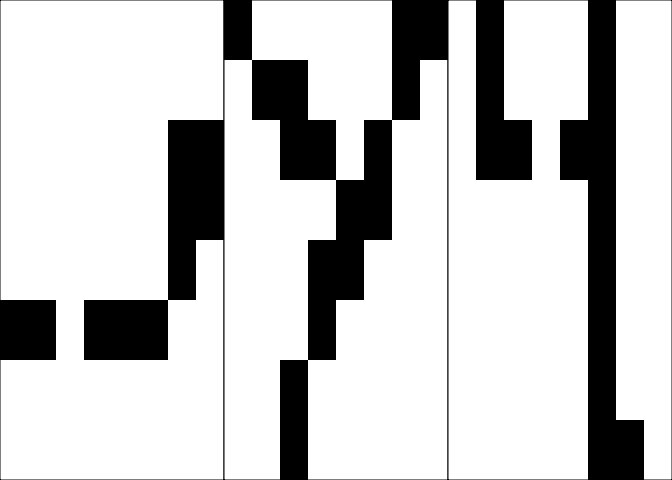
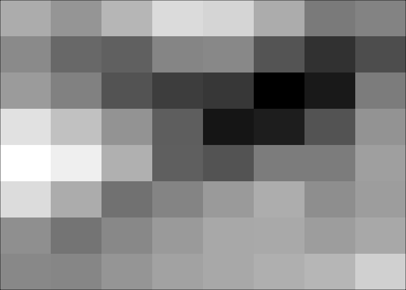
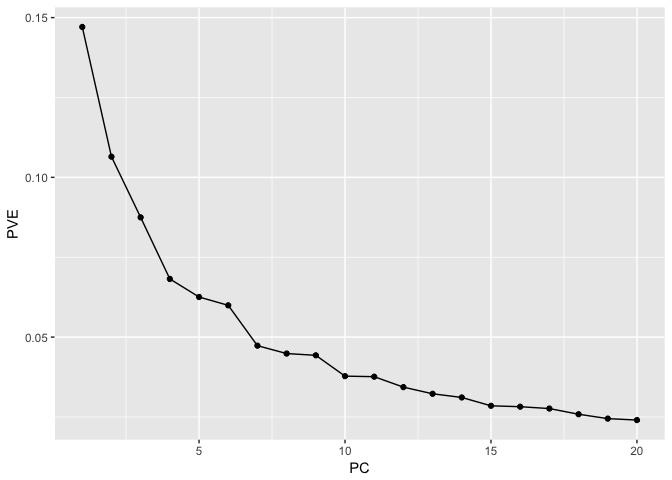
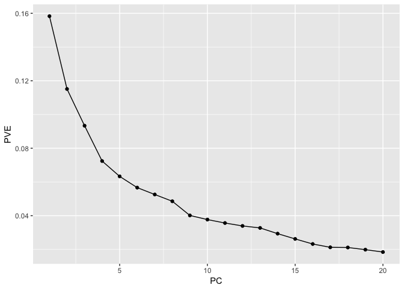
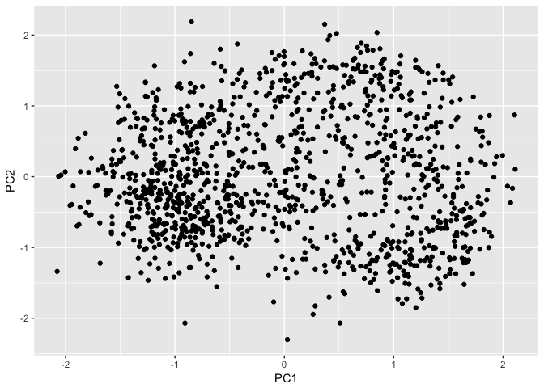
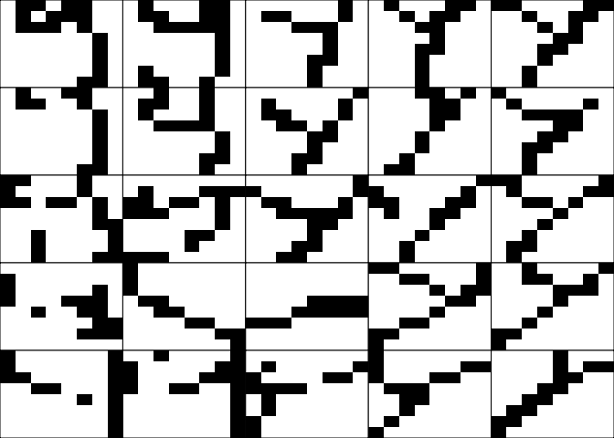
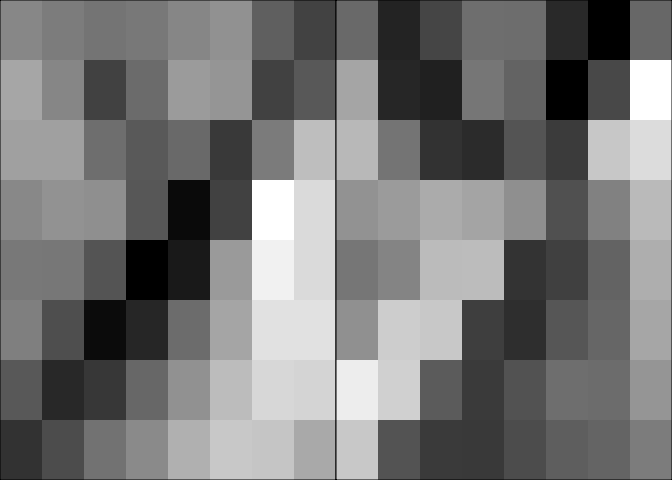
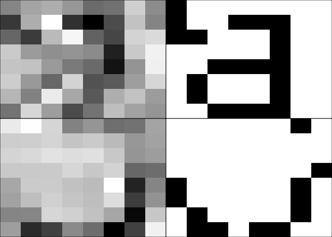

Problem Set 7
================
Jay Lee
November 13, 2017

1.  What do the columns and rows appear to represent in this dataset?

The rows each represent one image of a hand-drawn letter. The first column tells what letter it is, then columns 2-65 represent whether each of the 64 pixels is black (1) or white (0).

1.  Select a letter of the alphabet and create a new dataset that includes only the images of that letter.

``` r
y <- filter(d, letter == 'y')
```

1.  Visualize a few of those images using `plot_letter()` function.

``` r
par(mfrow=c(1,3))
plot_letter(y[3, ])
plot_letter(y[375, ])
plot_letter(y[1200, ])
```



1.  Compute the mean image for that letter and visualize it.

``` r
y_mean <- colSums(y[ ,-1]) / nrow(y)
plot_letter(y_mean, hasletter = FALSE)
```



1.  Perform PCA on your data set using the `prcomp()` function.

``` r
pca_y <- prcomp(y[ ,-1])
```

1.  Construct a scree plot showing the PVE for the first 20 PCs. How many dimensions are needed to capture most of the structure in this letter?

``` r
devs_y <- data.frame(PC = 1:20,
                PVE = pca_y$sdev[1:20]^2 / sum(pca_y$sdev[1:20]^2))
ggplot(devs_y, aes(x = PC, y = PVE)) +
  geom_line() + 
  geom_point()
```



7 dimensions are needed to capture most of the structure in the letter `y`.

1.  Select a second letter, perform PCA, and construct a second scree plot. How many dimensions are needed to capture most of the structure in this letter?

``` r
j <- filter(d, letter == 'j')
pca_j <- prcomp(j[ ,-1])
devs_j <- data.frame(PC = 1:20,
                PVE = pca_j$sdev[1:20]^2 / sum(pca_j$sdev[1:20]^2))
ggplot(devs_j, aes(x = PC, y = PVE)) +
  geom_line() + 
  geom_point()
```



9 dimensions are needed to capture most of the structure in the letter `j`.

1.  Returning to your first letter, make a scatterplot of the data plotted on the first two principle components. In this scatterplot, each dot will be an image of a letter and the axes will be *Z*<sub>1</sub> and *Z*<sub>2</sub>.

``` r
transformed_y <- data.frame(pca_y$x)
ggplot(transformed_y, aes(x = PC1, y = PC2)) +
  geom_point()
```



1.  Let’s try to build a sense of what the first two principle components are encoding by considering the letters that appear in different parts of this plot. The `pc_grid()` function overlay a 5x5 grid on your scatterplot like this. It will then select the images that are nearest to the red points and plot them. Run `pc_grid()` on your pca object and the original data and describe the structure in the letters (the meta-variable if you will) that each PC is capturing.

``` r
pc_grid(pca_y, y)
```



I can't tell which PC is on which axis, but going left to right the PC is capturing whether the letter is facing diagonally down and left or down and right. Going up and down, I think the PC is either capturing how "vertical" the y's tail is or how deep the bowl of the y is.

1.  Extract the loadings (rotation) from your PCA object and used plot\_letter() to plot your first two PCs. What variation they seem to be capturing?

``` r
loadings <- data.frame(pca_y$rotation)
par(mfrow=c(1,2))
plot_letter(loadings$PC1, hasletter = FALSE)
plot_letter(loadings$PC2, hasletter = FALSE)
```



The first component is tracking whether the triple point of the y is in the middle or on the right, i.e. whether the y is sweeping down the right edge or more centered (and usually angular). The second component is tracking whether the right tip of the y is on the edge of the image or closer to the center.

1.  Do these loadings conform with variation seen across the 5x5 grid of letters across the first two PCs?

These loadings do seem to match the variation in the letter grid. PC1 (left to right) captures whether the letter sweeps down along the right edge or is more centered, and PC2 (up and down) catches where the right tip of the y sits.

1.  Use the first ten principle components to reconstruct (and visualize) the first observation of each of the two letters that you studied. For each letter, plot the true image and the reconstructed image on the sampe plot. On visual inspection, how much information was lost?

``` r
ncomp <- 10

y_mean <- colMeans(y[ , -1])
phi_y <- pca_y$rotation
z_y <- pca_y$x
x_star_y <- z_y[1, 1:ncomp] %*% t(phi_y[, 1:ncomp]) + y_mean

j_mean <- colMeans(j[ , -1])
phi_j <- pca_j$rotation
z_j <- pca_j$x
x_star_j <- z_j[1, 1:ncomp] %*% t(phi_j[, 1:ncomp]) + j_mean

par(mfrow = c(2,2))
plot_letter(x_star_y, hasletter = FALSE)
plot_letter(y[1, ])
plot_letter(x_star_j, hasletter = FALSE)
plot_letter(j[1, ])
```



10 PCs isn't a great amount to plot the y, but we start to see some of the curve of the j in the bottom left plot. My estimates in questions 6 and 7 for how many components are needed to capture structure are clearly not enough to have reliable image reconstruction.
