Lab 1
================
Jay Lee
9/5/2017

1.  How many rows are in this data set? How many columns? What do the rows and columns represent?

``` r
dim(Boston)
```

    ## [1] 506  14

There are 506 rows and 14 columns. Each row is one town around Boston, and each column is a demographic variable recorded for the town.

1.  Make some (2-3) pairwise scatterplots of the predictors (columns) in this data set. Describe your findings.

``` r
ggplot(Boston, aes(indus, nox)) +
  geom_point()
```

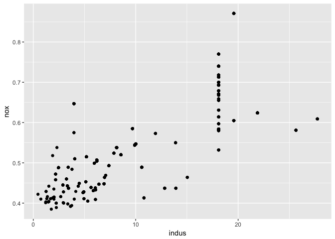

``` r
ggplot(Boston, aes(zn, rm)) +
  geom_point()
```

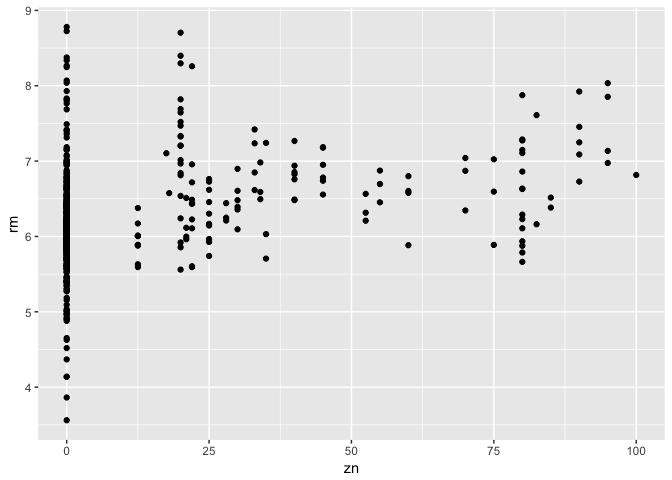

``` r
ggplot(Boston, aes(age, dis)) +
  geom_point()
```

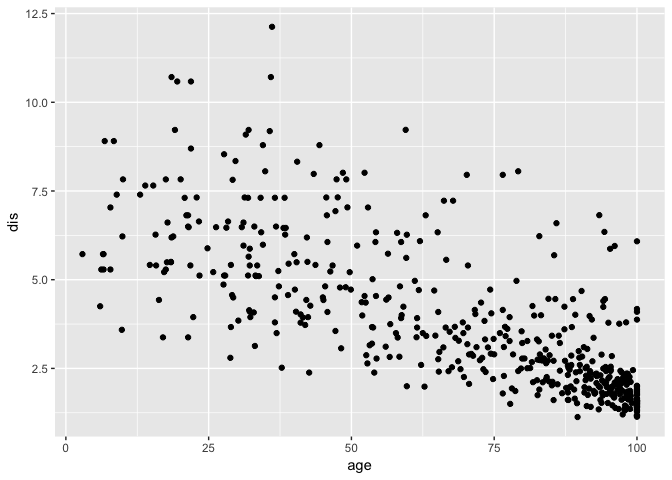

The first plot shows a weak to moderate positive linear relationship between the proportion of non-retail business acres per town and the nitrogen oxide concentration per town. The second shows proportion of residential land zoned for large lots and average number of rooms per dwelling. This shows some positive relationship among non-zero values of `zn`, but so many towns have a value of 0 for `zn` that it complicates a relationship. The final plot shows a weakly decreasing linear or fan-shaped relationship between the town's "age" and how far from major employment centers it is.

1.  Are any of the predictors associated with per capita crime rate? If so, explain the relationship.

``` r
r <- lm(crim~ zn + nox + dis + rad + black + medv , data = Boston)
summary(r)
```

    ## 
    ## Call:
    ## lm(formula = crim ~ zn + nox + dis + rad + black + medv, data = Boston)
    ## 
    ## Residuals:
    ##     Min      1Q  Median      3Q     Max 
    ## -10.240  -1.915  -0.376   0.852  75.438 
    ## 
    ## Coefficients:
    ##              Estimate Std. Error t value Pr(>|t|)    
    ## (Intercept) 14.642639   3.709443   3.947 9.04e-05 ***
    ## zn           0.053963   0.017305   3.118 0.001923 ** 
    ## nox         -9.238768   4.477580  -2.063 0.039597 *  
    ## dis         -0.992811   0.255075  -3.892 0.000113 ***
    ## rad          0.499838   0.044036  11.351  < 2e-16 ***
    ## black       -0.008711   0.003612  -2.412 0.016237 *  
    ## medv        -0.195990   0.037685  -5.201 2.90e-07 ***
    ## ---
    ## Signif. codes:  0 '***' 0.001 '**' 0.01 '*' 0.05 '.' 0.1 ' ' 1
    ## 
    ## Residual standard error: 6.452 on 499 degrees of freedom
    ## Multiple R-squared:  0.444,  Adjusted R-squared:  0.4373 
    ## F-statistic: 66.42 on 6 and 499 DF,  p-value: < 2.2e-16

``` r
ggplot(Boston, aes(x = rad, y = crim)) + geom_point()
```

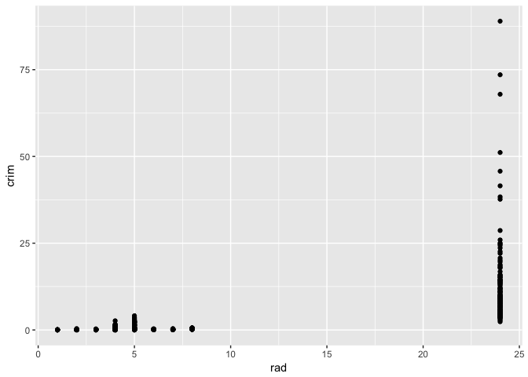

``` r
ggplot(Boston, aes(x = medv, y = crim)) + geom_point()
```

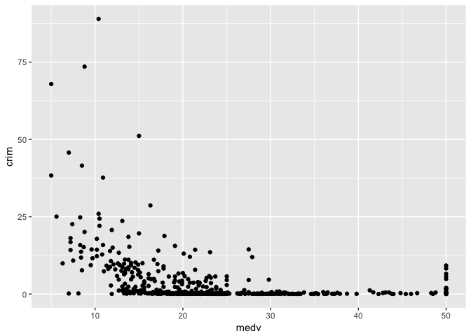

``` r
ggplot(Boston, aes(x = dis, y = crim)) + geom_point()
```

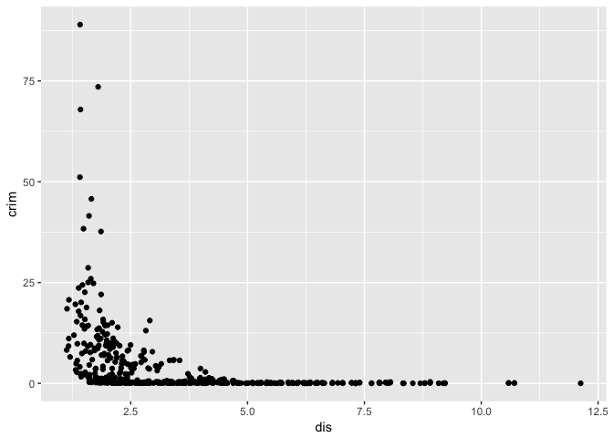

``` r
ggplot(Boston, aes(x = zn, y = crim)) + geom_point()
```

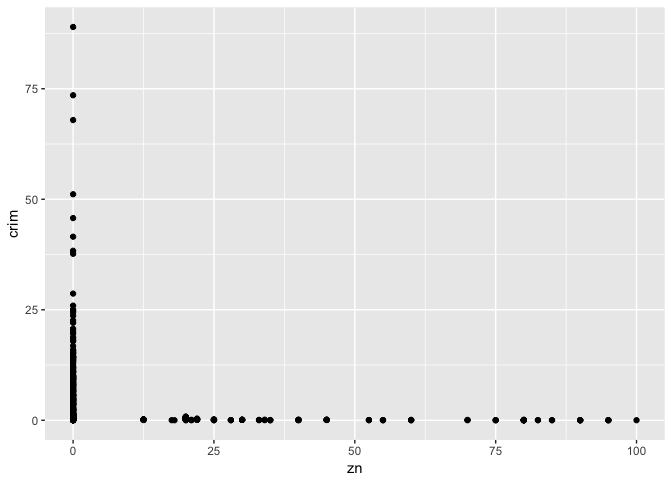

``` r
ggplot(Boston, aes(x = black, y = crim)) + geom_point()
```

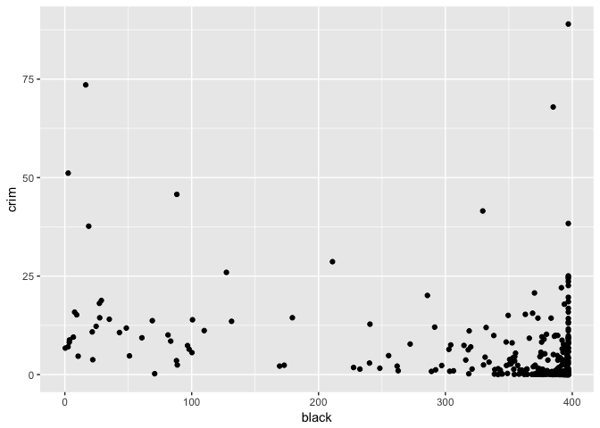

``` r
ggplot(Boston, aes(x = nox, y = crim)) + geom_point()
```

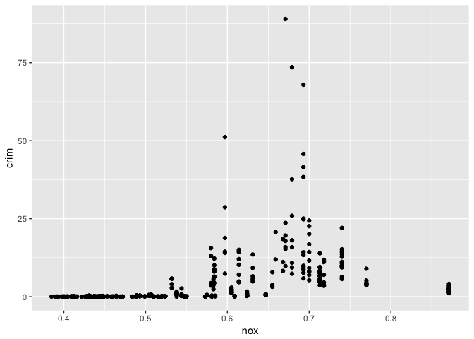

The model above (found using backwards selection) shows all the variables with a p-value above .05. Uopn closer examination of the variables, however, a linear relationship is not appropriate to fit for almost all of them. Many show a curved, fan-shaped, or unusual L-shaped distribution.

1.  Are there any suburbs of Boston that appear to have particularly high crime rates? Tax rate? Pupil-teacher ratios? Comment on the range of each predictor.

``` r
ggplot(Boston, aes(x = crim)) +
  geom_histogram()
```

    ## `stat_bin()` using `bins = 30`. Pick better value with `binwidth`.

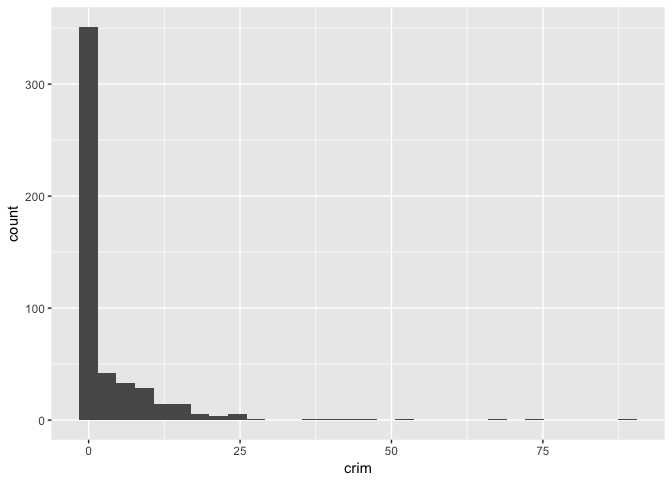

``` r
ggplot(Boston, aes(x = tax)) +
  geom_histogram()
```

    ## `stat_bin()` using `bins = 30`. Pick better value with `binwidth`.

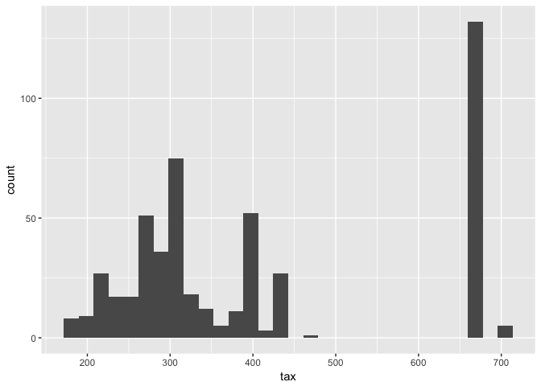

``` r
ggplot(Boston, aes(x = ptratio)) +
  geom_histogram()
```

    ## `stat_bin()` using `bins = 30`. Pick better value with `binwidth`.

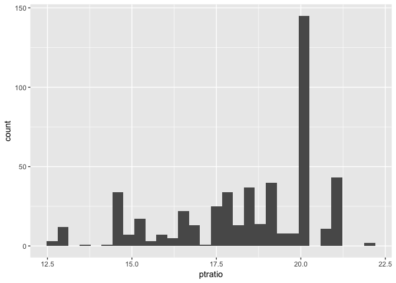

The distribution of crime rate is super right skewed, with the vast majority clustered around 0 and a small handful past 50. Tax rate seems to have a semi-normal or bimodal distribution aronud 300, but then a large amount close to 675. Pupil-to-teacher ratio is mostly left-skewed, with a large mode at 20.

1.  How many of the suburbs in this data set bound the Charles River?

``` r
sum(Boston$chas)
```

    ## [1] 35

1.  What is the median pupil-teacher ratio among the towns in this data set?

``` r
median(Boston$ptratio)
```

    ## [1] 19.05

1.  If you want to build a model to predict the average value of a home based on the other variables, what is your output/response? What is your input?

``` r
q <- lm(medv~lstat + black + ptratio + tax + rad + dis + rm + nox + chas + zn + crim, data = Boston)
summary(q)
```

    ## 
    ## Call:
    ## lm(formula = medv ~ lstat + black + ptratio + tax + rad + dis + 
    ##     rm + nox + chas + zn + crim, data = Boston)
    ## 
    ## Residuals:
    ##      Min       1Q   Median       3Q      Max 
    ## -15.5984  -2.7386  -0.5046   1.7273  26.2373 
    ## 
    ## Coefficients:
    ##               Estimate Std. Error t value Pr(>|t|)    
    ## (Intercept)  36.341145   5.067492   7.171 2.73e-12 ***
    ## lstat        -0.522553   0.047424 -11.019  < 2e-16 ***
    ## black         0.009291   0.002674   3.475 0.000557 ***
    ## ptratio      -0.946525   0.129066  -7.334 9.24e-13 ***
    ## tax          -0.011778   0.003372  -3.493 0.000521 ***
    ## rad           0.299608   0.063402   4.726 3.00e-06 ***
    ## dis          -1.492711   0.185731  -8.037 6.84e-15 ***
    ## rm            3.801579   0.406316   9.356  < 2e-16 ***
    ## nox         -17.376023   3.535243  -4.915 1.21e-06 ***
    ## chas          2.718716   0.854240   3.183 0.001551 ** 
    ## zn            0.045845   0.013523   3.390 0.000754 ***
    ## crim         -0.108413   0.032779  -3.307 0.001010 ** 
    ## ---
    ## Signif. codes:  0 '***' 0.001 '**' 0.01 '*' 0.05 '.' 0.1 ' ' 1
    ## 
    ## Residual standard error: 4.736 on 494 degrees of freedom
    ## Multiple R-squared:  0.7406, Adjusted R-squared:  0.7348 
    ## F-statistic: 128.2 on 11 and 494 DF,  p-value: < 2.2e-16

To build a linear model, we have

Output: `medv`

Input: `crim, zn, chas, nox, rm, dis, rad, tax, ptratio, black, lstat` (the other variables, at least the ones that are statistically significant)
