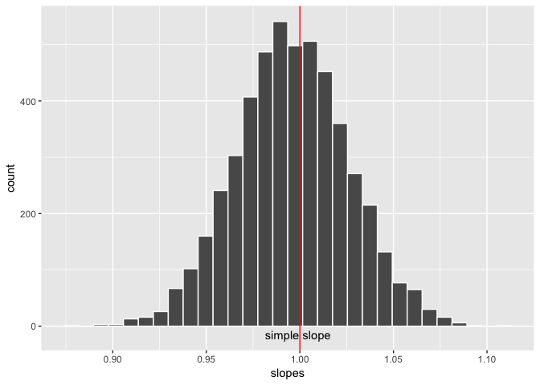
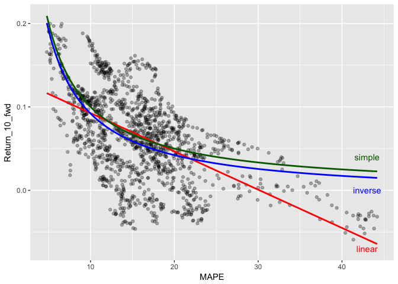

Hands off my stack
================
Jay Lee
October 22, 2017

1. Inventing a variable
-----------------------

### a.

``` r
d <- d %>%
  mutate(MAPE = Price / Earnings_10MA_back)
summary(d$MAPE)
```

    ##    Min. 1st Qu.  Median    Mean 3rd Qu.    Max.    NA's 
    ##   4.785  11.710  15.950  16.550  19.960  44.200     120

``` r
d <- na.omit(d)
```

There are exactly 120 NAs because for the first 10 years (120 entries), we don't have data 10 years previously, so there's no previous 10-year average.

### b.

``` r
linear_model <- lm(Return_10_fwd ~ MAPE, data = d)
summary(linear_model)
```

    ## 
    ## Call:
    ## lm(formula = Return_10_fwd ~ MAPE, data = d)
    ## 
    ## Residuals:
    ##       Min        1Q    Median        3Q       Max 
    ## -0.116777 -0.029650  0.004347  0.028478  0.093157 
    ## 
    ## Coefficients:
    ##               Estimate Std. Error t value Pr(>|t|)    
    ## (Intercept)  0.1383475  0.0029889   46.29   <2e-16 ***
    ## MAPE        -0.0045885  0.0001727  -26.57   <2e-16 ***
    ## ---
    ## Signif. codes:  0 '***' 0.001 '**' 0.01 '*' 0.05 '.' 0.1 ' ' 1
    ## 
    ## Residual standard error: 0.04321 on 1482 degrees of freedom
    ## Multiple R-squared:  0.3226, Adjusted R-squared:  0.3221 
    ## F-statistic: 705.8 on 1 and 1482 DF,  p-value: < 2.2e-16

``` r
tidy_lin <- tidy(linear_model)
```

The coefficient is -0.0045885, with a standard error of 1.727169710^{-4}, so the value is statistically significant at the 0.05 level.

### c.

``` r
set.seed(1940)
d <- d %>%
  mutate(fold = sample(rep(1:5, length.out = nrow(.)), size = nrow(.), replace = F))
lin_cv_mses <- rep(NA, 5)
for (i in seq_len(5)) {
 d_fold <- d[d$fold != i, ]
 cv_model <- lm(Return_10_fwd ~ MAPE, data = d_fold)
 preds <- predict(cv_model, newdata = d[d$fold == i, ])
 sq_errs <- (preds-d[d$fold == i, "Return_10_fwd"])^2
 lin_cv_mses[i] <- mean(sq_errs)
}

lin_MSE <- mean(lin_cv_mses)
lin_MSE
```

    ## [1] 0.001869117

Our 5-fold MSE is 0.0018691.

2. Inverting a variable
-----------------------

### a.

``` r
inverse_model <- lm(Return_10_fwd ~ I(1/MAPE), data = d)
summary(inverse_model)
```

    ## 
    ## Call:
    ## lm(formula = Return_10_fwd ~ I(1/MAPE), data = d)
    ## 
    ## Residuals:
    ##       Min        1Q    Median        3Q       Max 
    ## -0.106298 -0.030839  0.002955  0.028179  0.103866 
    ## 
    ## Coefficients:
    ##              Estimate Std. Error t value Pr(>|t|)    
    ## (Intercept) -0.007659   0.002878  -2.661  0.00788 ** 
    ## I(1/MAPE)    0.995904   0.036513  27.275  < 2e-16 ***
    ## ---
    ## Signif. codes:  0 '***' 0.001 '**' 0.01 '*' 0.05 '.' 0.1 ' ' 1
    ## 
    ## Residual standard error: 0.04284 on 1482 degrees of freedom
    ## Multiple R-squared:  0.3342, Adjusted R-squared:  0.3338 
    ## F-statistic: 743.9 on 1 and 1482 DF,  p-value: < 2.2e-16

``` r
tidy_inv <- tidy(inverse_model)
```

The coefficient is 0.9959036, with a standard error of 0.036513, so the value is statistically significant at the 0.05 level.

### b.

``` r
set.seed(2124)
d <- d %>%
  mutate(fold = sample(rep(1:5, length.out = nrow(.)), size = nrow(.), replace = F))
inv_cv_mses <- rep(NA, 5)
for (i in seq_len(5)) {
 d_fold <- d[d$fold != i, ]
 cv_model <- lm(Return_10_fwd ~ I(1/MAPE), data = d_fold)
 preds <- predict(cv_model, newdata = d[d$fold == i, ])
 sq_errs <- (preds-d[d$fold == i, "Return_10_fwd"])^2
 inv_cv_mses[i] <- mean(sq_errs)
}

inv_MSE <- mean(inv_cv_mses)
inv_MSE
```

    ## [1] 0.001839167

The cross-validated MSE for the inverse model is 0.0018392, slightly lower than the linear model.

3. A simple model
-----------------

### a.

``` r
simple_preds <- 1/d$MAPE
simple_sq_errs <- (simple_preds-d$Return_10_fwd)^2
simple_MSE <- mean(simple_sq_errs)
simple_MSE
```

    ## [1] 0.001896346

The training MSE of our simple model is 0.0018963.

### b.

The training MSE is exactly equal to the average test MSE, because there will be no variance between models for each fold. All 5 models will be exactly the same, `1/MAPE`, so the error term for each entry will be the same across each of the 4 models it's in.

4. Is simple sufficient?
------------------------

### a.

``` r
slopes <- rep(NA, 5000)
for(i in 1:5000) {
  boot_ind <- sample(1:nrow(d), size = nrow(d), replace = TRUE)
  d_boot <- d[boot_ind, ]
  m <- lm(Return_10_fwd ~ I(1/MAPE), data = d_boot)
  slopes[i] <- coefficients(m)[2]
}
df_slopes <- data.frame(slopes)
ggplot(df_slopes, aes(slopes)) +
  geom_histogram(color = "white") +
  geom_vline(xintercept = 1, color = "red") +
  annotate("text", x = 0.999 , y = -15, label = "simple slope")
```

    ## `stat_bin()` using `bins = 30`. Pick better value with `binwidth`.



### b.

``` r
quantiles <- qt(c(.025, .975), df=nrow(d)-2)
c(mean(slopes) + quantiles[1] * sd(slopes), mean(slopes) + quantiles[2] * sd(slopes))
```

    ## [1] 0.9369618 1.0549594

``` r
confint(inverse_model)
```

    ##                   2.5 %       97.5 %
    ## (Intercept) -0.01330433 -0.002013051
    ## I(1/MAPE)    0.92428102  1.067526198

The bounds on the bootstrapped CI for the model are slightly closer together than the bounds on the calculated CI. This difference might be due to how R picks a distribution for the CI. For this, I just used a t-distribution with 1482 degrees of freedom.

5. One big happy plot
---------------------

``` r
ggplot(d, aes(x = MAPE, y = Return_10_fwd)) +
  geom_point(alpha = .3) +
  geom_smooth(method = "lm", col = "red", se = FALSE) +
  geom_smooth(method = "lm", formula = y ~ I(1/x), col = "blue", se = FALSE) +
  stat_function(fun = function(x) 1/x, col = "darkgreen", size = 1) +
  annotate("text", x = 43 , y = 0.04, label = "simple", col = "darkgreen") +
  annotate("text", x = 43 , y = 0, label = "inverse", col = "blue") +
  annotate("text", x = 43 , y = -0.07, label = "linear", col = "red")
```



The big picture
---------------

Just using cross-validated MSE, I would use the inverse model we made. It doesn't predict the right tail of the data as well as the linear model, but it does better on the left tail. The simple model has less variance, but slightly more bias. Judging by our bootstrap distribution, however, the simple model is a plausible model. The "slope" of 1 falls well inside our bootstrapped confidence interval of 0.937 to 1.055.
