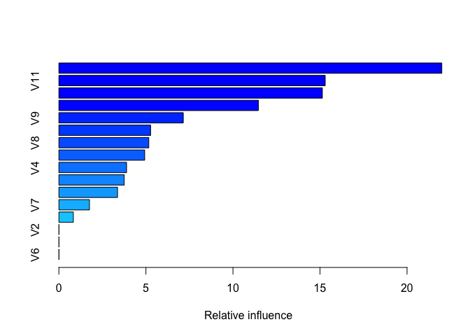
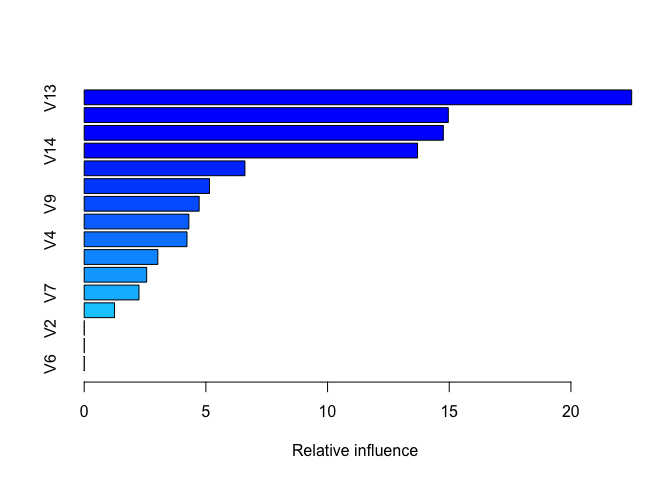
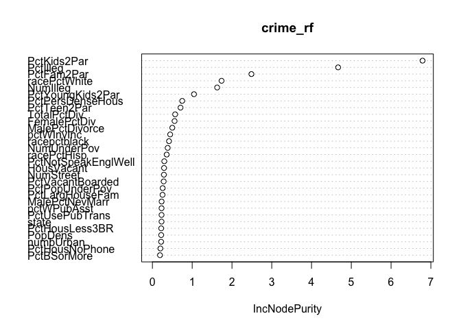

Lab 6
================
Jay Lee
November 4, 2017

Ransom notes keep falling
-------------------------

### The data

``` r
lettersdf <- read.csv("https://raw.githubusercontent.com/andrewpbray/math-243/master/assets/data/letters.csv",
                      header = FALSE)
set.seed(1)
train <- sample(1:nrow(lettersdf), nrow(lettersdf) * .75)
```

### Building a boosted tree

``` r
boost_char <- gbm(V1 ~ ., data = lettersdf[train, ],
                 distribution = "multinomial",
                 n.trees = 50,
                 shrinkage = 0.1)
summary(boost_char)
```



    ##     var    rel.inf
    ## V13 V13 21.9965247
    ## V11 V11 15.2993528
    ## V12 V12 15.1356499
    ## V14 V14 11.4595433
    ## V9   V9  7.1464605
    ## V15 V15  5.2694983
    ## V8   V8  5.1645842
    ## V10 V10  4.9290784
    ## V4   V4  3.8886848
    ## V17 V17  3.7521023
    ## V16 V16  3.3698812
    ## V7   V7  1.7579011
    ## V5   V5  0.8307385
    ## V2   V2  0.0000000
    ## V3   V3  0.0000000
    ## V6   V6  0.0000000

The most important variable in the boosted tree is V13, which tracks the correlation of vertical variance with horizontal position.

### Assessing predictions

1.  

``` r
yhat <- predict(boost_char,
                              newdata = lettersdf[-train, ],
                              n.trees = 50,
                              type = "response")
predicted <- LETTERS[apply(yhat, 1, which.max)]
conf_mat <- table(predicted, lettersdf[-train, 1])
kable(conf_mat)
```

|     |    A|    B|    C|    D|    E|    F|    G|    H|    I|    J|    K|    L|    M|    N|    O|    P|    Q|    R|    S|    T|    U|    V|    W|    X|    Y|    Z|
|-----|----:|----:|----:|----:|----:|----:|----:|----:|----:|----:|----:|----:|----:|----:|----:|----:|----:|----:|----:|----:|----:|----:|----:|----:|----:|----:|
| A   |  176|    0|    0|    0|    0|    0|    1|    0|    1|    0|    2|   10|    5|    0|    0|    0|    0|    0|    8|    0|    0|    0|    0|    0|    0|    0|
| B   |    0|  129|    0|   26|    5|   15|    3|    7|   12|   17|    2|    3|    1|    5|    1|    6|    8|   16|   13|    2|    1|    0|    0|    8|    1|    4|
| C   |    3|    0|  130|    0|   26|    0|   15|    0|    1|    3|    7|    7|    1|    3|    1|    0|    6|    0|    0|    0|    1|    0|    0|    0|    0|    0|
| D   |    0|   20|    0|  131|    0|   13|    6|   10|    6|    6|    4|    0|    1|    4|   10|   13|    0|    8|    5|    0|    1|    0|    0|    4|    4|    1|
| E   |    0|    0|   11|    1|   72|    1|    3|    0|    0|    0|    5|    1|    0|    0|    0|    1|    1|    5|    2|    4|    3|    0|    0|    2|    0|    7|
| F   |    0|    0|    3|    0|    0|  119|    0|    1|    2|    3|    0|    0|    0|    0|    0|   16|    0|    0|    2|   15|    0|    4|    4|    0|    5|    0|
| G   |    1|    2|    6|    0|   22|    6|  112|    4|    1|    0|    4|    8|    0|    0|    5|    3|   14|    1|    1|    0|    1|    0|    0|    0|    0|    1|
| H   |    0|    0|    0|    1|    0|    0|    1|   82|    0|    0|    4|    0|    1|    1|    0|    0|    0|    0|    2|    0|    0|    0|    0|   12|    0|    0|
| I   |    0|    0|    0|    0|    0|    4|    0|    0|  148|    2|    0|    0|    0|    0|    0|    1|    0|    0|    4|    5|    0|    0|    0|    0|    2|    0|
| J   |    3|    0|    0|    7|    0|    2|    0|    1|    9|  131|    0|    0|    0|    1|    0|    2|    2|    0|    1|    0|    0|    0|    0|    0|    0|    2|
| K   |    0|    1|   17|    2|   10|    0|    4|   13|    0|    0|  108|    3|    3|    0|    1|    0|    0|    2|    0|    2|    2|    0|    0|    8|    0|    1|
| L   |    2|    0|    0|    0|    0|    0|    2|    0|    0|    0|    1|  146|    0|    0|    3|    0|   11|    0|    1|    0|    0|    0|    0|    0|    0|    0|
| M   |    3|    7|    0|    1|    0|    1|    0|    3|    0|    3|    6|    0|  178|    8|    0|    0|    1|    9|    0|    0|   13|    2|   13|    1|    1|    0|
| N   |    0|    2|    0|    4|    1|    0|    0|    5|    0|    0|    5|    0|    5|  157|    1|    0|    0|    2|    0|    5|   15|    7|    4|    0|    0|    0|
| O   |    5|    1|    9|    7|    0|    0|    1|   28|    0|    4|    0|    0|    5|    8|  147|   10|   16|    3|    3|    3|   11|    1|    4|    4|    1|    0|
| P   |    0|    0|    0|    8|    0|   14|    0|    0|    3|    3|    0|    0|    0|    9|    0|  134|    0|    0|    0|    1|    0|    2|    0|    0|    1|    0|
| Q   |    1|    1|    1|    0|    8|    0|   19|    6|    1|    5|    0|    2|    1|    0|    5|    1|   98|    1|    3|    0|    3|    4|    0|    0|    8|    1|
| R   |    0|   12|    0|    7|    7|    3|   13|    9|    2|    7|   17|    2|    1|    2|    2|    0|    1|  152|   11|    0|    0|    0|    1|    1|    0|    4|
| S   |    2|    5|    4|    6|    9|    5|    6|    2|    2|    7|    0|    3|    1|    0|    0|    0|    6|    0|  122|    0|    0|    1|    0|    4|    4|   17|
| T   |    0|    0|    0|    2|    0|    6|    0|    2|    0|    0|    0|    0|    0|    0|    0|    0|    0|    0|    2|  137|    2|    5|    0|    0|   11|    3|
| U   |    0|    0|    2|    0|    2|    1|    0|   12|    0|    0|    0|    0|    0|    1|    2|    0|    0|    0|    1|    5|  145|    3|    0|    0|    3|    0|
| V   |    0|    0|    0|    0|    0|    0|    0|    0|    0|    0|    0|    0|    0|    0|    0|    0|    0|    0|    0|   10|    5|  127|    2|    0|   15|    0|
| W   |    0|    1|    2|    0|    0|    0|    6|    6|    0|    0|    2|    0|    4|    4|   10|    9|    1|    3|    0|    0|    1|   14|  142|    0|    2|    0|
| X   |    5|    3|    0|    0|   31|    2|    0|    3|    5|    0|   10|    1|    0|    0|    0|    0|    0|    3|   15|    8|    0|    0|    0|  128|    0|    3|
| Y   |    2|    0|    0|    0|    2|    5|    0|    0|    0|    0|    2|    8|    0|    5|    0|    4|    1|    0|    1|   11|    2|    4|    0|    9|  120|    0|
| Z   |    1|    0|    1|    0|   11|    0|    2|    0|    0|    0|    0|    0|    0|    0|    0|    0|    0|    0|    3|    2|    0|    0|    0|    5|    0|  133|

1.  

``` r
mcr <- 1 - sum(diag(conf_mat)) / 5000
mcr
```

    ## [1] 0.3192

Our misclassification rate, overall, is 0.3192.

1.  

``` r
letter_mcr <- function(x) {
  1 - conf_mat[x, x] / sum(conf_mat[ ,x])
}
letter_mcrs <- sapply(1:26, letter_mcr)
LETTERS[which.max(letter_mcrs)]
```

    ## [1] "E"

``` r
max(letter_mcrs)
```

    ## [1] 0.6504854

Judged by maximum misclassification rate (0.6504854), the letter E was the hardest to predict.

1.  

``` r
mixup <- function(x) {
  max <- max(conf_mat[-x, x])
  indices <- which(conf_mat[ ,x] == max)
  LETTERS[indices]
}
closest <- lapply(1:26, mixup)

matches <- list()
for (i in 1:26) {
  for (j in 1:26) {
    first <- LETTERS[i] %in% closest[j]
    second <- LETTERS[j] %in% closest[i]
    if (first & second) {
      matches <- list.append(matches, LETTERS[c(i, j)])
    }
  }
}
matches
```

    ## [[1]]
    ## [1] "B" "D"
    ## 
    ## [[2]]
    ## [1] "D" "B"

I checked to see if there were any pairs of letters which were most often misclassified as each other. By this metric, B/D was the hardest pair of letters to tell apart. Along the way I messed this up and ran it on some different test data, which also gave B/R and M/N as tricky pairs.

``` r
table(unlist(closest))
```

    ## 
    ## A B D F H K M N O P Q R S V W X 
    ## 2 5 2 2 1 1 1 2 4 1 1 1 1 1 2 3

In addition, from the above table we can see that the letters B, O, and X were guessed incorrectly on the most letters by the model.

### Slow the learning

``` r
boost_char_2 <- gbm(V1 ~ ., data = lettersdf[train, ],
                 distribution = "multinomial",
                 n.trees = 500,
                 shrinkage = 0.01)
summary(boost_char_2)
```



    ##     var   rel.inf
    ## V13 V13 22.496372
    ## V11 V11 14.960975
    ## V12 V12 14.756705
    ## V14 V14 13.697955
    ## V10 V10  6.604469
    ## V8   V8  5.146862
    ## V9   V9  4.723565
    ## V15 V15  4.299905
    ## V4   V4  4.223859
    ## V16 V16  3.025112
    ## V17 V17  2.567040
    ## V7   V7  2.251550
    ## V5   V5  1.245629
    ## V2   V2  0.000000
    ## V3   V3  0.000000
    ## V6   V6  0.000000

1.  

``` r
yhat2 <- predict(boost_char_2,
                              newdata = lettersdf[-train, ],
                              n.trees = 500,
                              type = "response")
predicted2 <- LETTERS[apply(yhat2, 1, which.max)]
conf_mat2 <- table(predicted2, lettersdf[-train, 1])
mcr2 <- 1 - sum(diag(conf_mat2)) / 5000
mcr2
```

    ## [1] 0.3194

Our misclassification rate, overall, is 0.3194, which is minutely higher than our original boosted tree.

1.  

``` r
mixup2 <- function(x) {
  max <- max(conf_mat2[-x, x])
  indices <- which(conf_mat2[ ,x] == max)
  LETTERS[indices]
}
closest2 <- lapply(1:26, mixup2)

matches2 <- list()
for (i in 1:26) {
  for (j in 1:26) {
    first <- LETTERS[i] %in% closest2[j]
    second <- LETTERS[j] %in% closest2[i]
    if (first & second) {
      matches2 <- list.append(matches2, LETTERS[c(i, j)])
    }
  }
}
matches2
```

    ## [[1]]
    ## [1] "B" "D"
    ## 
    ## [[2]]
    ## [1] "D" "B"
    ## 
    ## [[3]]
    ## [1] "F" "P"
    ## 
    ## [[4]]
    ## [1] "P" "F"

This time, the pair F/P was harder for the model to distinguish (in addition to B/D), by our metric for that.

Communities and Crime
---------------------

``` r
crime <- read.csv("http://andrewpbray.github.io/data/crime-train.csv", na = c("", "NA", "?")) %>%
  select(state, population:PctSameState85,
                LandArea:PctUsePubTrans, ViolentCrimesPerPop)
set.seed(1105171544)
training <- sample(1:nrow(crime), nrow(crime) * .75)
```

### Growing a random forest

``` r
crime_bag <- randomForest(ViolentCrimesPerPop ~ ., data = crime, subset = training, mtry = ncol(crime)-1)
crime_rf <- randomForest(ViolentCrimesPerPop ~ ., data = crime, subset = training)
bag_guess <- predict(crime_bag, newdata = crime[-training, ], type = "response")
bag_error <- mean((bag_guess - crime$ViolentCrimesPerPop[-training])^2)
forest_guess <- predict(crime_rf, newdata = crime[-training, ], type = "response")
forest_error <- mean((forest_guess - crime$ViolentCrimesPerPop[-training])^2)

group_C_fit <- function(training_data) {
lm(ViolentCrimesPerPop~ population + numbUrban + PctKids2Par + PctIlleg + PctHousOccup + PctHousOwnOcc + NumStreet + racePctWhite*PctWorkMom + MalePctDivorce*PctPersDenseHous, data = training_data)
}
group_C_MSE <- function(model, data){ 
  SE <- c()
  data <- data %>%
    mutate(y_hat = predict(model,data),
           sq_error = (ViolentCrimesPerPop-y_hat)^2)
  mean(data$sq_error)
}

crime_linear <- group_C_fit(crime[training, ])
linear_guess <- predict(crime_linear, crime[-training, ], type = "response")
linear_error <- mean((linear_guess - crime$ViolentCrimesPerPop[-training])^2)

bag_error
```

    ## [1] 0.01678017

``` r
forest_error
```

    ## [1] 0.01668911

``` r
linear_error
```

    ## [1] 0.01645187

We get a slight improvement from the random forest, but neither performs as well as the linear regression.

### Variance importance

``` r
tidy(summary(crime_linear)) %>%
  select(term, estimate, p.value) %>%
  arrange(desc(estimate))
```

    ##                               term    estimate      p.value
    ## 1                        numbUrban  1.71600880 8.642198e-06
    ## 2                      (Intercept)  0.66588974 1.683314e-08
    ## 3  MalePctDivorce:PctPersDenseHous  0.65321144 2.086871e-04
    ## 4          racePctWhite:PctWorkMom  0.35753725 5.044056e-03
    ## 5                        NumStreet  0.18638882 9.876645e-04
    ## 6                         PctIlleg  0.17440435 1.074174e-02
    ## 7                   MalePctDivorce  0.09554455 1.457818e-01
    ## 8                    PctHousOwnOcc  0.08411957 4.777216e-02
    ## 9                     PctHousOccup -0.08799861 1.548289e-02
    ## 10                PctPersDenseHous -0.18970350 4.510522e-02
    ## 11                    racePctWhite -0.35734931 6.449279e-05
    ## 12                      PctWorkMom -0.35755152 4.816969e-04
    ## 13                     PctKids2Par -0.36622132 2.625087e-05
    ## 14                      population -1.69102785 1.445905e-05

``` r
varImpPlot(crime_rf)
```



The ordering of importance isn't entirely the same, but we see the same types of variables show up in both models: `PctKids2Par`, `PctIlleg`, `racePctWhite`, etc.

### One last boost

``` r
boost_crime <- gbm(ViolentCrimesPerPop ~ ., data = crime[training, ],
                 distribution = "multinomial",
                 n.trees = 300,
                 shrinkage = 0.05,
                 interaction.depth = 2)
double_guess <- predict(boost_crime, newdata = crime[-training, ], n.trees = 300, type = "response")
double_error <- mean((double_guess - crime$ViolentCrimesPerPop[-training])^2)
double_error
```

    ## [1] 0.08703414

The boosted tree MSE is much worse than all 3 of the above models. I don't really have a theoretical concept about the crime data to think about why this happened.
