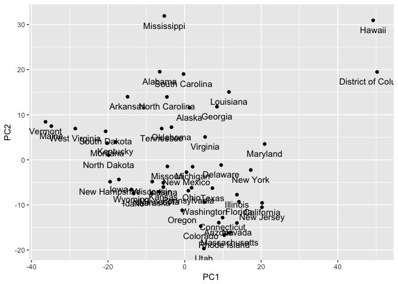
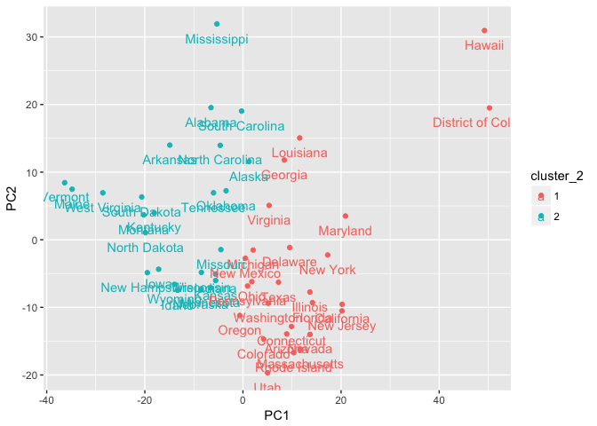
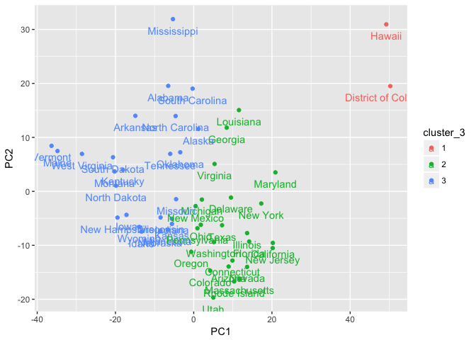
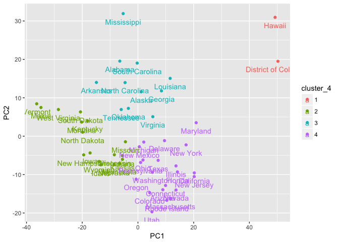
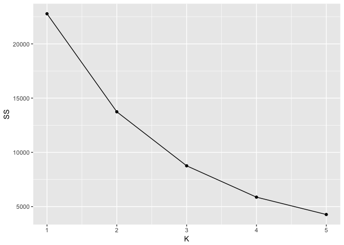
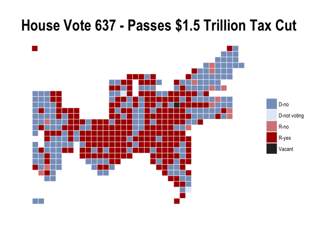
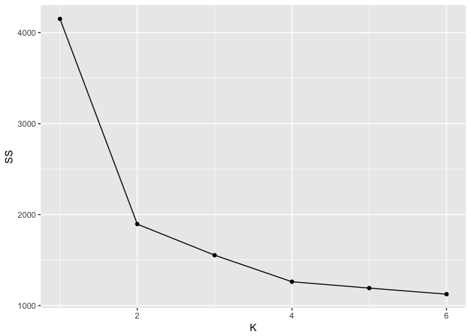
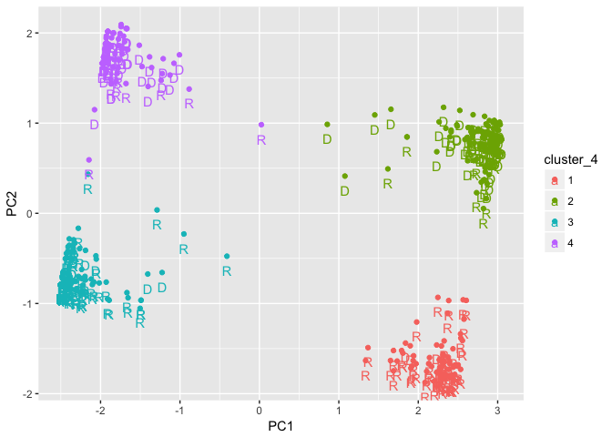

I trust I can rely on your vote
================
Jay Lee
11/19/2017

Part I
------

### 1

``` r
km2 <- kmeans(poverty[ ,-1], 2, nstart = 25)
kd2 <- data.frame(poverty$State, "k" = km2$cluster)

km3 <- kmeans(poverty[ ,-1], 3, nstart = 25)
kd3 <- data.frame(poverty$State, "k" = km3$cluster)

km4 <- kmeans(poverty[ ,-1], 4, nstart = 25)
kd4 <- data.frame(poverty$State, "k" = km4$cluster)

different_k <- left_join(kd2, kd3, by = "poverty.State") %>%
  left_join(kd4, by = "poverty.State") %>%
  arrange(poverty.State)
colnames(different_k) <- c("state", "k_2", "k_3", "k_4")

kable(different_k)
```

| state                |  k\_2|  k\_3|  k\_4|
|:---------------------|-----:|-----:|-----:|
| Alabama              |     2|     3|     3|
| Alaska               |     2|     3|     3|
| Arizona              |     1|     2|     4|
| Arkansas             |     2|     3|     3|
| California           |     1|     2|     4|
| Colorado             |     1|     2|     4|
| Connecticut          |     1|     2|     4|
| Delaware             |     1|     2|     4|
| District of Columbia |     1|     1|     1|
| Florida              |     1|     2|     4|
| Georgia              |     1|     2|     3|
| Hawaii               |     1|     1|     1|
| Idaho                |     2|     3|     2|
| Illinois             |     1|     2|     4|
| Indiana              |     2|     3|     2|
| Iowa                 |     2|     3|     2|
| Kansas               |     2|     3|     2|
| Kentucky             |     2|     3|     2|
| Louisiana            |     1|     2|     3|
| Maine                |     2|     3|     2|
| Maryland             |     1|     2|     4|
| Massachusetts        |     1|     2|     4|
| Michigan             |     1|     2|     4|
| Minnesota            |     2|     3|     2|
| Mississippi          |     2|     3|     3|
| Missouri             |     2|     3|     2|
| Montana              |     2|     3|     2|
| Nebraska             |     2|     3|     2|
| Nevada               |     1|     2|     4|
| New Hampshire        |     2|     3|     2|
| New Jersey           |     1|     2|     4|
| New Mexico           |     1|     2|     4|
| New York             |     1|     2|     4|
| North Carolina       |     2|     3|     3|
| North Dakota         |     2|     3|     2|
| Ohio                 |     1|     2|     4|
| Oklahoma             |     2|     3|     3|
| Oregon               |     1|     2|     4|
| Pennsylvania         |     1|     2|     4|
| Rhode Island         |     1|     2|     4|
| South Carolina       |     2|     3|     3|
| South Dakota         |     2|     3|     2|
| Tennessee            |     2|     3|     3|
| Texas                |     1|     2|     4|
| Utah                 |     1|     2|     4|
| Vermont              |     2|     3|     2|
| Virginia             |     1|     2|     3|
| Washington           |     1|     2|     4|
| West Virginia        |     2|     3|     2|
| Wisconsin            |     2|     3|     2|
| Wyoming              |     2|     3|     2|

### 2

``` r
pca_pov <- prcomp(poverty[, -1])
pov_pcs <- data.frame(PC1 = pca_pov$x[, 1],
                PC2 = pca_pov$x[, 2],
                cluster_2 = as.factor(km2$cluster),
                cluster_3 = as.factor(km3$cluster),
                cluster_4 = as.factor(km4$cluster),
                state = poverty$State)
ggplot(pov_pcs, aes(x = PC1, y = PC2)) +
  geom_point() +
  geom_text(aes(label = state), vjust = 2)
```



### 3

``` r
ggplot(pov_pcs, aes(x = PC1, y = PC2, col = cluster_2)) +
  geom_point() +
  geom_text(aes(label = state), vjust = 2)
```



``` r
ggplot(pov_pcs, aes(x = PC1, y = PC2, col = cluster_3)) +
  geom_point() +
  geom_text(aes(label = state), vjust = 2)
```



``` r
ggplot(pov_pcs, aes(x = PC1, y = PC2, col = cluster_4)) +
  geom_point() +
  geom_text(aes(label = state), vjust = 2)
```



### 4

``` r
km1 <- kmeans(poverty[ ,-1], 1, nstart = 25)
km5 <- kmeans(poverty[ ,-1], 5, nstart = 25)

scree <- data.frame("K" = 1:5,
                 "SS" = c(km1$tot.withinss,
                          km2$tot.withinss,
                          km3$tot.withinss,
                          km4$tot.withinss,
                          km5$tot.withinss))
ggplot(scree, aes(x = K, y = SS)) +
  geom_point() +
  geom_line()
```



There's no clear "elbow" in the scree plot, indicating that there's not really a best number of clusters.

Part II
-------

### 1

``` r
cut_cut_cut <- roll_call(critter = "house", 115, session = 1L, rcall = 637)
cut_cut_cut$description
```

    ## [1] "Tax Cuts and Jobs Act"

``` r
cut_cut_cut$date_of_vote
```

    ## [1] "November 16, 2017"

``` r
cut_cut_cut$result
```

    ## [1] "Passed"

``` r
OR <- filter(cut_cut_cut$votes, state_abbrev == "OR")
kable(OR[ , c(3, 5, 6, 8, 9)])
```

| member\_name     | party | state\_abbrev |  district| position |
|:-----------------|:------|:--------------|---------:|:---------|
| Earl Blumenauer  | D     | OR            |         3| No       |
| Suzanne Bonamici | D     | OR            |         1| No       |
| Peter A. DeFazio | D     | OR            |         4| No       |
| Kurt Schrader    | D     | OR            |         5| No       |
| Greg Walden      | R     | OR            |         2| Yes      |

-   The name of the bill was the Tax Cut and Jobs Act.
-   It was voted upon on 11/16/2017.
-   The bill passed the House.
-   Oregon's 5 representatives voted 4-1 on party lines against the bill.

``` r
house_carto(cut_cut_cut, pp_square=TRUE) +
  labs(x=NULL, y=NULL, 
       title="House Vote 637 - Passes $1.5 Trillion Tax Cut") +
  hrbrthemes::theme_ipsum(plot_title_size = 24) +
  theme_voteogram()
```



### 2

``` r
votes <- matrix(NA, nrow = 435, ncol = 50)
rcall_ind <- 588:637

for(i in 1:length(rcall_ind)) {
  votes[, i] <- roll_call("house", 115, 1, rcall_ind[i])$votes$position
}

vote_yes <- votes == "Yes"

dim(votes)
```

    ## [1] 435  50

`votes` is 435 observations (representatives) by 50 variables (distinct bil votes). `vote_yes` is just `votes` recoded so that voting "Yes" is `TRUE` and any other action ("No", "Not Voting") is `FALSE`.

### 3

``` r
pol2 <- kmeans(vote_yes, 2, nstart = 25)
table(pol2$cluster, cut_cut_cut$votes$party)
```

    ##    
    ##       D   R
    ##   1 116  81
    ##   2  78 159

For the most part the clustering identifies party lines.

### 4

``` r
pol1 <- kmeans(vote_yes[ ,-1], 1, nstart = 25)
pol3 <- kmeans(vote_yes[ ,-1], 3, nstart = 25)
pol4 <- kmeans(vote_yes[ ,-1], 4, nstart = 25)
pol5 <- kmeans(vote_yes[ ,-1], 5, nstart = 25)
pol6 <- kmeans(vote_yes[ ,-1], 6, nstart = 25)

pol_scree <- data.frame("K" = 1:6,
                 "SS" = c(pol1$tot.withinss,
                          pol2$tot.withinss,
                          pol3$tot.withinss,
                          pol4$tot.withinss,
                          pol5$tot.withinss,
                          pol6$tot.withinss))
ggplot(pol_scree, aes(x = K, y = SS)) +
  geom_point() +
  geom_line()
```



### 5

``` r
pca_pol <- prcomp(vote_yes)
pol_pcs <- data.frame(rep = cut_cut_cut$votes$member_name,
                      PC1 = pca_pol$x[, 1],
                      PC2 = pca_pol$x[, 2],
                      cluster_4 = as.factor(pol4$cluster),
                      party = cut_cut_cut$votes$party)
ggplot(pol_pcs, aes(x = PC1, y = PC2, color = cluster_4)) +
  geom_point() +
  geom_text(aes(label = party), vjust = 2)
```

    ## Warning: Removed 1 rows containing missing values (geom_text).



### 6

The first several loadings can tell us in which directions the data has the most variance, i.e. in which directions the data points are most different from each other.

### 7

``` r
table(pol_pcs$party, pol_pcs$PC1 < 0)
```

    ##    
    ##     FALSE TRUE
    ##   D   116   78
    ##   R    82  158

``` r
kable(head(arrange(pol_pcs, PC1, PC2), 50))
```

| rep               |        PC1|         PC2| cluster\_4 | party |
|:------------------|----------:|-----------:|:-----------|:------|
| Vern Buchanan     |  -2.503237|  -0.7924973| 3          | R     |
| Joe L. Barton     |  -2.503174|  -0.7900314| 3          | R     |
| Mark Amodei       |  -2.501853|  -0.7935351| 3          | R     |
| Jodey Arrington   |  -2.501853|  -0.7935351| 3          | R     |
| Don Bacon         |  -2.501853|  -0.7935351| 3          | R     |
| Jim Banks         |  -2.501853|  -0.7935351| 3          | R     |
| Lou Barletta      |  -2.501853|  -0.7935351| 3          | R     |
| Gus Bilirakis     |  -2.501853|  -0.7935351| 3          | R     |
| Rob Bishop        |  -2.501853|  -0.7935351| 3          | R     |
| Susan Brooks      |  -2.501853|  -0.7935351| 3          | R     |
| Larry Bucshon     |  -2.501853|  -0.7935351| 3          | R     |
| Bradley Byrne     |  -2.501853|  -0.7935351| 3          | R     |
| Ken Calvert       |  -2.501853|  -0.7935351| 3          | R     |
| Steven J. Chabot  |  -2.501853|  -0.7935351| 3          | R     |
| Barbara Comstock  |  -2.501853|  -0.7935351| 3          | R     |
| Paul Cook         |  -2.501853|  -0.7935351| 3          | R     |
| Kevin Cramer      |  -2.501853|  -0.7935351| 3          | R     |
| Rick Crawford     |  -2.501853|  -0.7935351| 3          | R     |
| John Culberson    |  -2.501853|  -0.7935351| 3          | R     |
| Karen Handel      |  -2.501853|  -0.7935351| 3          | R     |
| Trent Kelly       |  -2.501853|  -0.7935351| 3          | R     |
| Doug LaMalfa      |  -2.501853|  -0.7935351| 3          | R     |
| Billy Long        |  -2.501853|  -0.7935351| 3          | R     |
| Frank D. Lucas    |  -2.501853|  -0.7935351| 3          | R     |
| Tom Marino        |  -2.501853|  -0.7935351| 3          | R     |
| Kevin McCarthy    |  -2.501853|  -0.7935351| 3          | R     |
| Michael McCaul    |  -2.501853|  -0.7935351| 3          | R     |
| Greg Walden       |  -2.501853|  -0.7935351| 3          | R     |
| Mark Walker       |  -2.501853|  -0.7935351| 3          | R     |
| Peter Roskam      |  -2.501791|  -0.7910693| 3          | R     |
| Rick Allen        |  -2.501713|  -0.7931985| 3          | R     |
| John Curtis       |  -2.494027|  -0.7960350| 3          | R     |
| David Kustoff     |  -2.494027|  -0.7960350| 3          | R     |
| Dennis Ross       |  -2.494027|  -0.7960350| 3          | R     |
| Glenn Thompson    |  -2.494027|  -0.7960350| 3          | R     |
| Don Young         |  -2.494027|  -0.7960350| 3          | R     |
| Trent Franks      |  -2.483674|  -0.7021657| 3          | R     |
| David A. Brat     |  -2.480853|  -0.7195301| 3          | R     |
| Joe Wilson        |  -2.479294|  -0.6963232| 3          | R     |
| Steve Russell     |  -2.478356|  -0.8046657| 3          | R     |
| Ted Budd          |  -2.477035|  -0.8081695| 3          | R     |
| John Carter       |  -2.477035|  -0.8081695| 3          | R     |
| Andy Harris       |  -2.477035|  -0.8081695| 3          | R     |
| Mark Meadows      |  -2.477035|  -0.8081695| 3          | R     |
| Martha Roby       |  -2.477035|  -0.8081695| 3          | R     |
| John Moolenaar    |  -2.475389|  -0.7152317| 3          | R     |
| Sean Duffy        |  -2.469699|  -0.6556660| 3          | R     |
| Brian Fitzpatrick |  -2.469699|  -0.6556660| 3          | R     |
| Glenn Grothman    |  -2.469699|  -0.6556660| 3          | R     |
| Jody Hice         |  -2.469699|  -0.6556660| 3          | R     |

Together, the first two components do a good job of separating Repubicans from Democrats. I can't really tell what they do individually.
